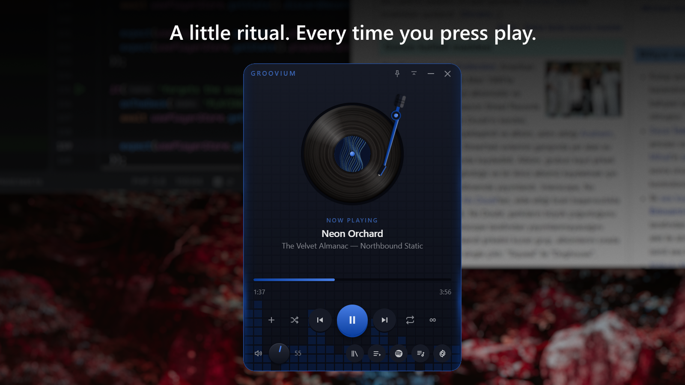
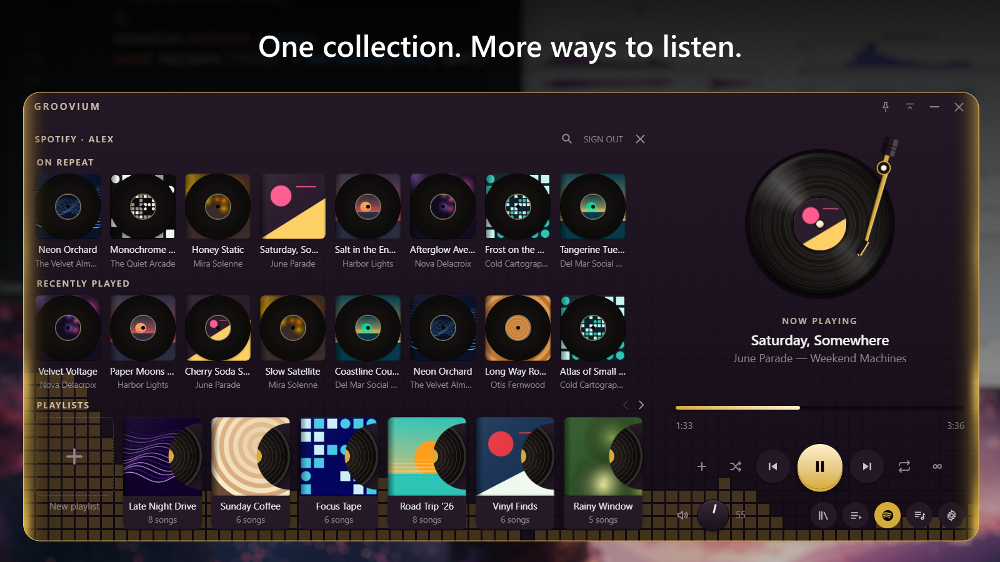
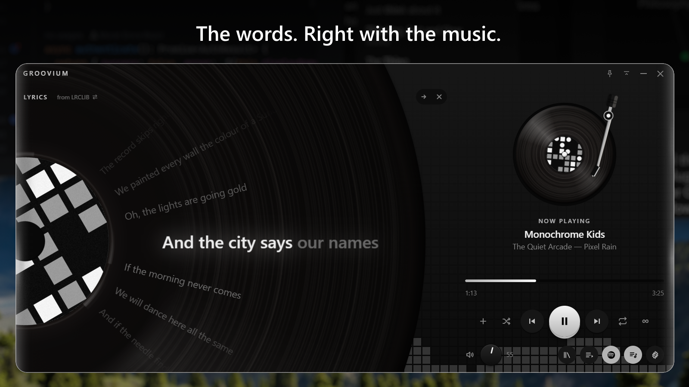

<p align="center">
  <strong>English</strong> · <a href="README_TR.md">Türkçe</a>
</p>

<!-- Optional logo: uncomment this block if you want an icon above the title.
<p align="center">
  
</p>
-->

<h1 align="center">Groovium</h1>
<p align="center"><strong>The music you love. A new way to feel it.</strong></p>
<p align="center">Groovium brings the ritual of vinyl to your desktop.<br>Your local library and Spotify, together on a turntable made for today.</p>

<p align="center">
  <a href="https://github.com/MuratBicici/Groovium/releases/latest">Download for Windows</a> ·
  <a href="#getting-started">Getting started</a> ·
  <a href="#development">For developers</a>
</p>

<!-- 1. A little ritual. Every time you press play. — title is part of the image. -->
<p align="center"></p>
<p align="center">A spinning record, a moving tonearm, and music within reach.<br>Lift the record and set it down again. Make listening a little more hands-on.</p>

<!-- 2. One collection. More ways to listen. -->
<p align="center"></p>
<p align="center">Your local favourites and Spotify tracks, together in Groovium playlists.<br>Bring your music, choose a track, and settle in. <a href="#spotify-setup">Spotify Premium and setup required.</a></p>

<!-- 3. The words. Right with the music. -->
<p align="center"></p>
<p align="center">Follow the words beneath the record or open them in the drawer.<br>When timed lyrics are available, each line lights up as it is sung. Select a line to return to that moment.</p>

<p align="center"><sub>Screenshots use fictional music, artwork and lyrics for demonstration.</sub></p>

## The last track doesn't have to be the last.

Turn on **Infinite play** and let something similar follow your collection. Suggestions use Last.fm, look in your own library first, and can reach into Spotify when connected.

A familiar sound. Somewhere new to go.

Requires a free Last.fm API key. [Set up Infinite play](#infinite-play).

## Make room for your music.

Choose a palette, create one from your own colours, or let the album cover set the mood. Keep the player on top, collapse it to its controls, and use your media keys without leaving what you are doing.

English and Turkish are built in. So are a tray icon, a remembered window position, and in-app updates. When the player is out of sight, it can pause its visual effects to reduce graphics work.

## Your music stays yours.

No Groovium account. No analytics or telemetry. Local audio files are never uploaded.

Groovium contacts GitHub for update checks, and external music and lyrics services when their features are configured or enabled. See [Privacy](PRIVACY.md) for the services, data and local storage involved.

---

<a id="getting-started"></a>
## Getting started

1. Download the Windows installer from [Releases](https://github.com/MuratBicici/Groovium/releases/latest).
2. Install Groovium for your Windows user account. The installer offers English and Turkish.
3. Import local tracks or connect Spotify, then choose something to play.

**Windows only.** Spotify playback uses the Web Playback SDK inside WebView2. The Windows installer currently has no Authenticode code signature, so Windows may display a SmartScreen warning.

Updates are available in **Settings → About**. For changes between versions, see the [changelog](CHANGELOG.md).

<a id="spotify-setup"></a>
### Connect Spotify

**Spotify Premium is required to play Spotify tracks in Groovium. Free accounts cannot stream through the app.** This is a [Spotify Web Playback SDK requirement](https://developer.spotify.com/documentation/web-playback-sdk/tutorials/getting-started). Local music playback does not require Spotify or Premium.

To connect Spotify, create a personal app registration in its Developer Dashboard, then copy its Client ID into Groovium. No coding is needed. Groovium's Spotify panel also walks you through the setup.

1. **Open the Dashboard.** Sign in to the [Spotify Developer Dashboard](https://developer.spotify.com/dashboard) with the Spotify account you will use in Groovium, then select **Create app**.
2. **Choose a name and description.** Fill in **App name** and **App description** however you like. For example, use `Groovium Personal` and `Listen to Spotify in Groovium`.
3. **Add the redirect address.** In the form's **Redirect URIs** section, enter `http://127.0.0.1:14536/callback` and add it to the list. Copy it exactly: do not replace `127.0.0.1` with `localhost` or add a trailing slash.
4. **Select both APIs and create the app.** Under **Which API/SDKs are you planning to use?**, tick **Web API** and **Web Playback SDK**. Both are needed; without Web Playback SDK, Spotify tracks will not play. Review and accept Spotify's required terms, then save the form to create the app.
5. **Add your Spotify account.** Open the new app's **User Management** section and select **Add new user**. Enter your name and the email address associated with the Spotify account you will use in Groovium, then save. If your account is already listed, you can continue.
6. **Copy the Client ID.** Return to the app's overview or **Settings** page and copy **Client ID**. You do not need **Client Secret**.
7. **Connect in Groovium.** Open Groovium's Spotify panel, paste the Client ID into its field and save it. Start the Spotify sign-in flow, sign in with the same Premium account, and approve the requested access to complete the connection.

If the connection does not work, check that both APIs are selected, the redirect URI matches exactly, and the email in User Management belongs to the account you signed in with. Authentication uses OAuth with PKCE, so Groovium does not ask for a Client Secret.

Save tracks to a Groovium playlist to keep them across restarts. Search results themselves are not saved.

<a id="infinite-play"></a>
### Set up Infinite play

Press **∞** beside repeat and enter a [Last.fm API key](https://www.last.fm/api/account/create). In the key application form, supply an application name and description; homepage and callback URL can be left blank. Groovium does not link a Last.fm account or scrobble your listening.

The switch controls automatic continuation after your collection ends. **Next** can request a suggestion at the end of the collection even when the switch is off. Repeat-all keeps the collection looping, so Infinite play does not take over. If no playable suggestion is available, playback can stop.

### A few things to know

- Importing creates Groovium's own copy of each file and uses additional disk space. Later edits to the original file do not update the imported tags.
- Embedded cover art larger than 8 MB is skipped.
- The player opens with an empty deck. Playback preferences are restored; a track is not automatically loaded.
- Lyrics availability and timing vary by recording. Lookups use LRCLIB, with NetEase as a fallback for timed lyrics; results stay in memory while the app is open.

---

<a id="development"></a>
## For developers

Groovium is built with **Tauri 2, React 19, TypeScript and Rust**, with Zustand for state and Vite for the frontend build.

### Run locally

Use Windows with Node.js **22.13+ on the 22.x line, or 24.x**, Rust via [rustup](https://rustup.rs/), Visual Studio Build Tools with **Desktop development with C++**, and the WebView2 runtime. CI uses Node 22; use `npm ci` to install the locked dependencies.

```bash
git clone https://github.com/MuratBicici/Groovium.git
cd Groovium
npm ci
npm run tauri dev
```

`npm run dev` starts a browser-only UI preview. Native imports, playback and service calls require the Tauri app.

| Command | Purpose |
| --- | --- |
| `npm run typecheck` | Check TypeScript |
| `npm run lint` | Run ESLint |
| `npm test` | Run Vitest tests |
| `npm run build` | Build the frontend |
| `cargo test --manifest-path src-tauri/Cargo.toml` | Run Rust tests |
| `npm run tauri build` | Build the Windows app and installer; updater signing configuration is required |

### Architecture

```text
src/core/          Providers, playback state and application logic
  types/           Shared AudioProvider contract
  providers/       Local audio and Spotify implementations
  store/           Library, playlists and playback orchestration
  station/         Similarity lookup and suggestion selection
  lyrics/          Lyrics state, timing and layout
  theme/           Colours derived from cover art
  settings/        Preferences
  i18n/            English and Turkish strings
  updates/         In-app update flow
src/components/    React interface
src/platform/      Window, tray, media keys and logging
src-tauri/         Rust shell, storage, OAuth and service bridges
```

Components read selectors and call store actions. They do not import providers. The store routes playback through the [`AudioProvider`](src/core/types/provider.ts) contract, allowing a collection to contain tracks from different sources.

Local playback uses an `HTMLAudioElement`; [`audio.rs`](src-tauri/src/audio.rs) is a native-audio stub, not the active playback engine.

<details>
<summary><strong>Extending the player</strong></summary>

Implement `AudioProvider`, using `BaseProvider` for event handling, and register it in `playerStore.initialize()`. Emit `state`, `progress`, `track`, `ended` and `error` events. An `ended` event includes `{ trackId }` so a late event cannot skip a newly selected track.

For UI work, use the narrow hooks in [`selectors.ts`](src/core/store/selectors.ts) and actions on `usePlayerStore`. Preserve the progress bar's drag guard, opt buttons out of window drag regions, and keep the volume knob's angle clamping and live store reads.

Infinite play combines Last.fm similarity, artist lookups and a Spotify genre fallback. It prioritises local matches and bounds Spotify searches. Recent listening informs selection; repetition avoidance can relax when the available catalogue is small. See [`station/`](src/core/station) for the selection logic.

</details>

<details>
<summary><strong>Storage and security</strong></summary>

- Spotify refresh tokens stay in Windows Credential Manager. Rust refreshes them and supplies short-lived access tokens to the webview.
- The Spotify Client ID and Last.fm API key live in the app's `config.json`. `GROOVIUM_SPOTIFY_CLIENT_ID` can also supply the Client ID.
- File selection, library copies and playlist writes are handled by Rust. Asset access is scoped to the managed library directory; keep the static asset scope empty.
- Credential-store commands must remain internal to Rust. Do not expose arbitrary secret or file access to the webview.
- Settings and the library index live under `%APPDATA%\com.groovium.desktop`; logs and the Spotify cache use `%LOCALAPPDATA%\com.groovium.desktop`.

See [`PRIVACY.md`](PRIVACY.md) for the complete storage and network behaviour, including sign-out and uninstall details.

</details>

<details>
<summary><strong>Debugging and verification</strong></summary>

In a development build, open DevTools with right-click → Inspect or F12. Restart `tauri dev` after changing provider code: provider instances survive hot reload.

Logs are written to `%LOCALAPPDATA%\com.groovium.desktop\logs\groovium.log`. The logging layer redacts tokens, keys and search queries. See [`VERIFY.md`](VERIFY.md) for manual checks and remaining verification work.

The [check workflow](.github/workflows/check.yml) runs TypeScript checks, lint, frontend tests and build, Rust tests, and a Rust build with warnings treated as errors on Windows.

</details>

<details>
<summary><strong>Builds, releases and signing</strong></summary>

The [release workflow](.github/workflows/release.yml) runs on `v*` tags and creates a **draft** release with an NSIS installer and updater artifacts.

Before tagging, align versions in `package.json`, `src-tauri/Cargo.toml` and `src-tauri/tauri.conf.json`, refresh the affected lockfiles, and add the matching version section to `CHANGELOG.md`. Release notes are embedded into the updater metadata during the build; editing the release draft later does not update those embedded notes. Keep notes readable as plain text for the app.

Updater artifacts require `TAURI_SIGNING_PRIVATE_KEY` and `TAURI_SIGNING_PRIVATE_KEY_PASSWORD` in repository secrets, or the local build environment. The public key belongs in `plugins.updater.pubkey` in `tauri.conf.json`. Never commit the private key.

Updater signing and Windows Authenticode signing are separate. The former verifies update artifacts; the latter identifies the installer publisher and is not currently configured.

Publishing the draft makes the release available through the public GitHub update endpoint. Review the installer and notes before publishing.

</details>

### What's next

Character theme packs are being designed, with separately installed artwork. They are **not implemented**, and the format is still a draft. See the [design](docs/character-themes.md) and [pack format](docs/theme-packs.md).

### Feedback and license

Found a bug or have an idea? [Open an issue](https://github.com/MuratBicici/Groovium/issues) with the app version and steps to reproduce where relevant.

Groovium is released under the [MIT License](LICENSE).
