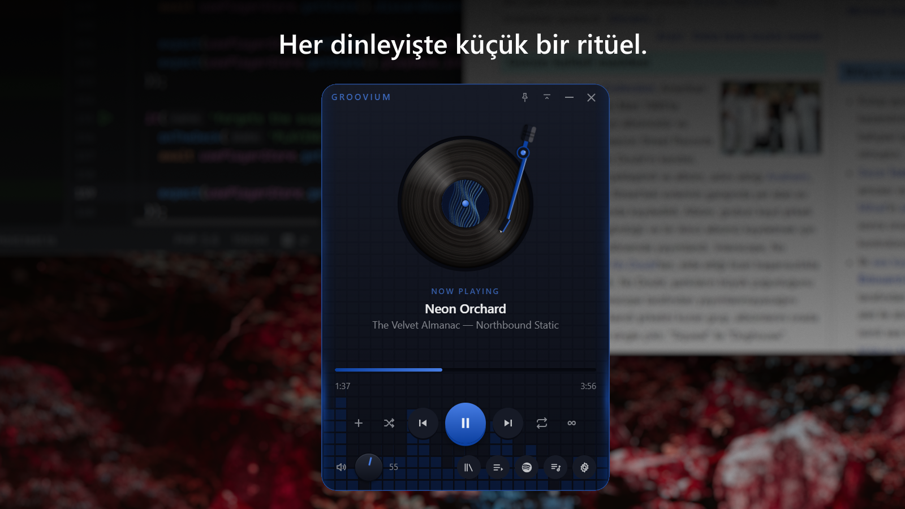
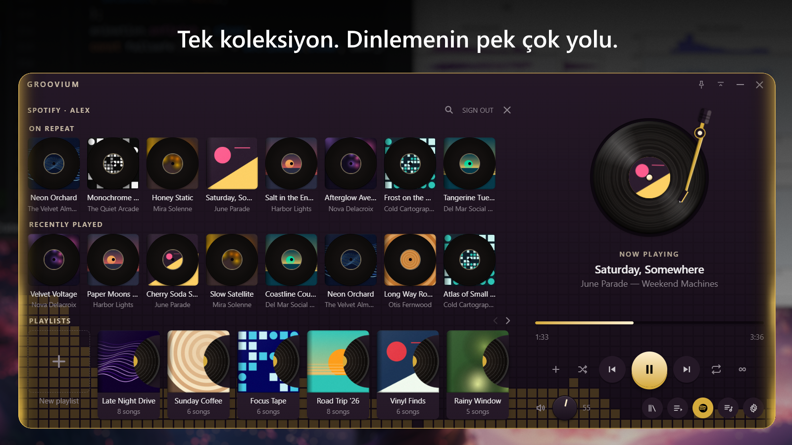
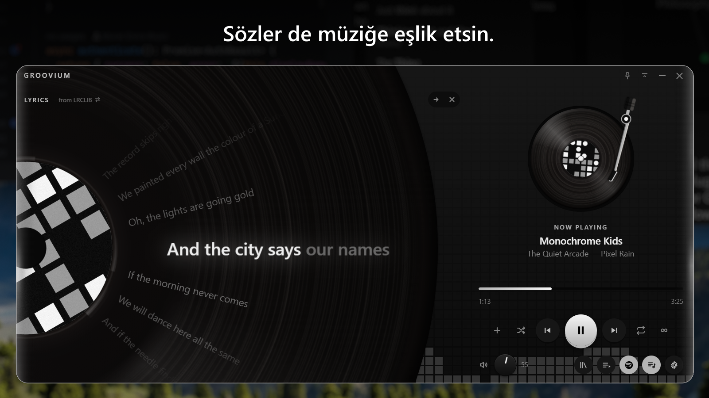

<p align="center">
  <a href="README.md">English</a> · <strong>Türkçe</strong>
</p>

<!-- İsteğe bağlı logo: başlığın üzerinde ikon istersen bu bloğu yorumdan çıkar.
<p align="center">
  
</p>
-->

<h1 align="center">Groovium</h1>
<p align="center"><strong>Sevdiğin müzik. Yepyeni bir his.</strong></p>
<p align="center">Groovium, plak dinleme ritüelini masaüstüne taşır.<br>Yerel arşivin ve Spotify, bugün için tasarlanmış bir pikapta buluşur.</p>

<p align="center">
  <a href="https://github.com/MuratBicici/Groovium/releases/latest">Windows için indir</a> ·
  <a href="#getting-started">Başlarken</a> ·
  <a href="#development">Geliştiriciler için</a>
</p>

<!-- 1. Küçük bir ritüel. — başlık görselin içinde yer alır. -->
<p align="center"></p>
<p align="center">Dönen bir plak, müziği takip eden bir kol. Her şey elinin altında.<br>Plağı kaldır, yeniden yerine bırak. Dinlemenin keyfine küçük bir dokunuş kat.</p>

<!-- 2. Tek koleksiyon. Dinlemenin pek çok yolu. -->
<p align="center"></p>
<p align="center">Arşivindeki favoriler ve Spotify parçaları, aynı Groovium çalma listesinde.<br>Müziğini getir, bir parça seç ve kendine zaman ayır. <a href="#spotify-setup">Spotify Premium ve kurulum gerekir.</a></p>

<!-- 3. Sözler de müziğe eşlik etsin. -->
<p align="center"></p>
<p align="center">Sözleri plağın altında takip et veya yan panelde aç.<br>Zamanlamalı sözler bulunduğunda her satır söylendikçe aydınlanır. Bir satıra dokun, o ana geri dön.</p>

<p align="center"><sub>Ekran görüntülerindeki müzikler, kapaklar ve şarkı sözleri tanıtım için kurgulanmıştır.</sub></p>

## Son parça, son olmak zorunda değil.

**Sonsuz çalma** özelliğini aç. Koleksiyonun bittiğinde benzer bir parçayla devam et. Öneriler Last.fm'den gelir, önce kendi arşivinde aranır ve Spotify bağlıysa oradan da çalınabilir.

Tanıdık bir tını. Keşfedilecek yeni bir yer.

Ücretsiz bir Last.fm API anahtarı gerekir. [Sonsuz çalmayı ayarla](#infinite-play).

## Müziğine yer aç.

Bir palet seç, kendi renklerinle bir tane oluştur ya da renkleri albüm kapağına bırak. Oynatıcıyı hep üstte tut, yalnızca kontrollere küçült ve yaptığın işi bölmeden medya tuşlarını kullan.

Türkçe ve İngilizce hazır. Sistem tepsisi simgesi, hatırlanan pencere konumu ve uygulama içi güncellemeler de öyle. Oynatıcı görünmediğinde görsel efektlerini durdurarak grafik yükünü azaltabilir.

## Müziğin sana ait kalır.

Groovium hesabı yok. Analitik veya telemetri yok. Yerel ses dosyaların hiçbir yere yüklenmez.

Groovium, güncelleme kontrolü için GitHub'a; ilgili özellikler ayarlandığında veya açıldığında ise müzik ve şarkı sözü servislerine bağlanır. Kullanılan servisler, paylaşılan veriler ve yerel depolama için [gizlilik belgesine](PRIVACY.md) bakabilirsin.

---

<a id="getting-started"></a>
## Başlarken

1. [Sürümler sayfasından](https://github.com/MuratBicici/Groovium/releases/latest) Windows kurulum dosyasını indir.
2. Groovium'u kendi Windows kullanıcı hesabına kur. Kurulum sihirbazı Türkçe ve İngilizce sunar.
3. Yerel parçalarını içe aktar veya Spotify'ı bağla. Ardından dinlemek istediğin bir parça seç.

**Yalnızca Windows.** Spotify oynatımı, WebView2 içindeki Web Playback SDK'yı kullanır. Windows kurulum dosyasında henüz Authenticode kod imzası bulunmadığından Windows bir SmartScreen uyarısı gösterebilir.

Güncellemeleri **Ayarlar → Hakkında** bölümünden yükleyebilirsin. Sürümler arasındaki yenilikler [değişiklik günlüğünde](CHANGELOG.tr.md).

<a id="spotify-setup"></a>
### Spotify'ı bağla

**Groovium'da Spotify parçalarını çalmak için Spotify Premium gerekir. Ücretsiz hesaplarla uygulama üzerinden Spotify müziği çalınamaz.** Bu, [Spotify Web Playback SDK'nın bir gereksinimidir](https://developer.spotify.com/documentation/web-playback-sdk/tutorials/getting-started). Yerel müziklerini dinlemek için Spotify veya Premium gerekmez.

Spotify'ı bağlamak için Developer Dashboard'da kişisel bir uygulama kaydı oluşturup Client ID değerini Groovium'a kopyalaman yeterli. Kod yazman gerekmez. Groovium'un Spotify paneli de kurulum boyunca sana yol gösterir.

1. **Dashboard'u aç.** [Spotify Developer Dashboard](https://developer.spotify.com/dashboard) sayfasına Groovium'da kullanacağın Spotify hesabıyla giriş yap ve **Create app** seçeneğine bas.
2. **Ad ve açıklama gir.** **App name** ve **App description** alanlarını istediğin gibi doldurabilirsin. Örneğin ad olarak `Groovium Personal`, açıklama olarak `Groovium ile Spotify dinlemek için` yazabilirsin.
3. **Yönlendirme adresini ekle.** Formdaki **Redirect URIs** bölümüne `http://127.0.0.1:14536/callback` yaz ve adresi listeye ekle. Adresi aynen kopyala: `127.0.0.1` yerine `localhost` yazma ve sonuna eğik çizgi ekleme.
4. **İki API'yi de seç ve uygulamayı oluştur.** **Which API/SDKs are you planning to use?** bölümünde hem **Web API** hem de **Web Playback SDK** seçeneğini işaretle. İkisi de gerekli; Web Playback SDK seçilmezse Spotify parçaları çalmaz. Spotify'ın zorunlu koşullarını okuyup kabul ettikten sonra formu kaydederek uygulamayı oluştur.
5. **Kendi Spotify hesabını ekle.** Oluşturduğun uygulamanın **User Management** bölümünü aç ve **Add new user** seçeneğine bas. Adını ve Groovium'da kullanacağın Spotify hesabına bağlı e-posta adresini girerek kaydet. Hesabın zaten listeleniyorsa devam edebilirsin.
6. **Client ID'yi kopyala.** Uygulamanın ana sayfasına veya **Settings** bölümüne dön ve **Client ID** değerini kopyala. **Client Secret** değerine ihtiyacın yok.
7. **Groovium'da bağlantıyı tamamla.** Groovium'un Spotify panelini aç, Client ID'yi ilgili alana yapıştır ve kaydet. Spotify'a bağlanma işlemini başlat; aynı Premium hesabıyla giriş yapıp istenen erişim izinlerini onayla.

Bağlantı kurulmazsa iki API'nin de seçili olduğunu, yönlendirme adresinin birebir eşleştiğini ve User Management'taki e-postanın giriş yaptığın hesaba ait olduğunu kontrol et. Kimlik doğrulama OAuth ve PKCE kullandığı için Groovium senden Client Secret istemez.

Parçaları sonraki açılışlarda da bulmak için bir Groovium çalma listesine kaydet. Arama sonuçları kendiliğinden kaydedilmez.

<a id="infinite-play"></a>
### Sonsuz çalmayı ayarla

Tekrar düğmesinin yanındaki **∞** düğmesine bas ve bir [Last.fm API anahtarı](https://www.last.fm/api/account/create) gir. Anahtar başvurusunda uygulama adı ve açıklaması yaz; ana sayfa ve yönlendirme adresi alanlarını boş bırakabilirsin. Groovium bir Last.fm hesabını bağlamaz veya dinlediklerini scrobble olarak kaydetmez.

Bu düğme, koleksiyon bittiğinde otomatik devam etmeyi belirler. **Sonraki** düğmesi, özellik kapalıyken de koleksiyon sonunda öneri isteyebilir. Tümünü tekrarla açıkken koleksiyon döngüde kalır ve sonsuz çalma devreye girmez. Çalınabilir bir öneri bulunamazsa oynatım durabilir.

### Bilmekte fayda var

- İçe aktarma, her dosyanın Groovium'a ait bir kopyasını oluşturur ve ek disk alanı kullanır. Orijinal dosyada sonradan yaptığın değişiklikler, içe aktarılan etiketleri güncellemez.
- 8 MB'tan büyük gömülü kapak görselleri atlanır.
- Oynatıcı boş bir pikapla açılır. Oynatma tercihlerin hatırlanır; otomatik olarak bir parça yüklenmez.
- Şarkı sözlerinin bulunabilirliği ve zamanlaması kayda göre değişir. LRCLIB kullanılır; zamanlamalı sözler için NetEase'e de başvurulabilir. Sonuçlar uygulama açıkken bellekte tutulur.

---

<a id="development"></a>
## Geliştiriciler için

Groovium; **Tauri 2, React 19, TypeScript ve Rust** ile geliştirilir. Durum yönetiminde Zustand, ön yüz derlemesinde Vite kullanılır.

### Yerel ortamda çalıştırma

Windows üzerinde Node.js **22.x serisinde 22.13 veya üzerini ya da 24.x**, [rustup](https://rustup.rs/) üzerinden Rust, **Desktop development with C++** iş yüküyle Visual Studio Build Tools ve WebView2 çalışma zamanını kur. CI, Node 22 kullanır. Kilit dosyasındaki bağımlılıkları `npm ci` ile yükle.

```bash
git clone https://github.com/MuratBicici/Groovium.git
cd Groovium
npm ci
npm run tauri dev
```

`npm run dev`, arayüzün tarayıcı ön izlemesini başlatır. Yerel dosya aktarımı, oynatım ve servis çağrıları için Tauri uygulaması gerekir.

| Komut | İşlev |
| --- | --- |
| `npm run typecheck` | TypeScript denetimi |
| `npm run lint` | ESLint denetimi |
| `npm test` | Vitest testleri |
| `npm run build` | Ön yüz derlemesi |
| `cargo test --manifest-path src-tauri/Cargo.toml` | Rust testleri |
| `npm run tauri build` | Windows uygulaması ve kurulum dosyası; güncelleyici imza ayarları gerekir |

### Mimari

```text
src/core/          Sağlayıcılar, oynatma durumu ve uygulama mantığı
  types/           Ortak AudioProvider sözleşmesi
  providers/       Yerel ses ve Spotify uygulamaları
  store/           Arşiv, çalma listeleri ve oynatım yönetimi
  station/         Benzerlik sorguları ve öneri seçimi
  lyrics/          Şarkı sözlerinin durumu, zamanlaması ve yerleşimi
  theme/           Kapak görselinden türetilen renkler
  settings/        Tercihler
  i18n/            İngilizce ve Türkçe metinler
  updates/         Uygulama içi güncelleme akışı
src/components/    React arayüzü
src/platform/      Pencere, sistem tepsisi, medya tuşları ve günlükler
src-tauri/         Rust kabuğu, depolama, OAuth ve servis köprüleri
```

Bileşenler seçicilerden durum okur ve store eylemlerini çağırır; sağlayıcıları doğrudan içe aktarmaz. Store, oynatımı [`AudioProvider`](src/core/types/provider.ts) sözleşmesi üzerinden yönlendirir. Böylece bir koleksiyonda farklı kaynaklara ait parçalar bulunabilir.

Yerel oynatım `HTMLAudioElement` kullanır. [`audio.rs`](src-tauri/src/audio.rs), yerel ses motoru için ayrılmış bir taslaktır; etkin oynatma motoru değildir.

<details>
<summary><strong>Oynatıcıyı genişletme</strong></summary>

Olay yönetimi için `BaseProvider` kullanarak `AudioProvider` sözleşmesini uygula ve sağlayıcıyı `playerStore.initialize()` içinde kaydet. `state`, `progress`, `track`, `ended` ve `error` olaylarını üret. `ended`, `{ trackId }` içerir; böylece gecikmiş bir olay yeni seçilen parçayı atlatamaz.

Arayüz geliştirmelerinde [`selectors.ts`](src/core/store/selectors.ts) içindeki dar kapsamlı hook'ları ve `usePlayerStore` eylemlerini kullan. İlerleme çubuğunun sürükleme korumasını koru, düğmeleri pencere sürükleme bölgelerinden çıkar ve ses düğmesinin açı sınırlarını ve güncel store okumalarını koru.

Sonsuz çalma; Last.fm benzerlik verilerini, sanatçı sorgularını ve Spotify türlerine dayanan yedek aramayı birleştirir. Yerel eşleşmelere öncelik verir ve Spotify sorgularını sınırlar. Yakın dinleme geçmişi seçimi etkiler; katalog küçükse tekrarları önleme kuralları esneyebilir. Seçim mantığı [`station/`](src/core/station) altında bulunur.

</details>

<details>
<summary><strong>Depolama ve güvenlik</strong></summary>

- Spotify yenileme belirteçleri Windows Kimlik Bilgisi Yöneticisi'nde kalır. Rust bunları yeniler ve webview'a kısa ömürlü erişim belirteçleri verir.
- Spotify Client ID ve Last.fm API anahtarı uygulamanın `config.json` dosyasında tutulur. Client ID, `GROOVIUM_SPOTIFY_CLIENT_ID` üzerinden de sağlanabilir.
- Dosya seçimi, arşiv kopyaları ve çalma listesi yazımları Rust tarafından yürütülür. Dosya erişimi yönetilen arşiv diziniyle sınırlıdır; statik asset kapsamını boş tut.
- Kimlik bilgisi deposuna erişen komutlar Rust içinde kalmalıdır. Webview'a gelişigüzel dosya veya gizli veri erişimi açma.
- Ayarlar ve arşiv dizini `%APPDATA%\com.groovium.desktop` altında; günlükler ve Spotify önbelleği `%LOCALAPPDATA%\com.groovium.desktop` altında tutulur.

Çıkış yapma ve kaldırma ayrıntıları dahil tüm depolama ve ağ davranışı için [`PRIVACY.md`](PRIVACY.md) belgesine bak.

</details>

<details>
<summary><strong>Hata ayıklama ve doğrulama</strong></summary>

Geliştirme derlemesinde sağ tık → Inspect veya F12 ile geliştirici araçlarını aç. Sağlayıcı kodunu değiştirdikten sonra `tauri dev` sürecini yeniden başlat; sağlayıcı örnekleri sıcak yenilemede yaşamaya devam eder.

Günlükler `%LOCALAPPDATA%\com.groovium.desktop\logs\groovium.log` dosyasına yazılır. Günlük katmanı belirteçleri, anahtarları ve arama sorgularını maskeler. Elle yapılan kontroller ve kalan doğrulama işleri [`VERIFY.md`](VERIFY.md) içinde tutulur.

[Kontrol iş akışı](.github/workflows/check.yml); Windows üzerinde TypeScript, lint, ön yüz testleri ve derlemesi, Rust testleri ve uyarıları hata sayan bir Rust derlemesi çalıştırır.

</details>

<details>
<summary><strong>Derleme, sürüm yayımlama ve imzalama</strong></summary>

[Sürüm iş akışı](.github/workflows/release.yml), `v*` etiketlerinde çalışır ve NSIS kurulum dosyasıyla güncelleyici dosyalarını içeren bir **taslak sürüm** oluşturur.

Etiket oluşturmadan önce `package.json`, `src-tauri/Cargo.toml` ve `src-tauri/tauri.conf.json` sürümlerini eşitle, etkilenen kilit dosyalarını güncelle ve `CHANGELOG.md` içine ilgili sürüm bölümünü ekle. Sürüm notları derleme sırasında güncelleyici verisine gömülür; taslağı sonradan düzenlemek gömülü notları değiştirmez. Uygulamada okunabilmeleri için notları düz metne uygun yaz.

Güncelleyici dosyaları için depo secrets alanında veya yerel derleme ortamında `TAURI_SIGNING_PRIVATE_KEY` ve `TAURI_SIGNING_PRIVATE_KEY_PASSWORD` gerekir. Açık anahtar, `tauri.conf.json` içindeki `plugins.updater.pubkey` alanına yazılır. Özel anahtarı asla repoya ekleme.

Güncelleyici imzası ile Windows Authenticode imzası ayrıdır. İlki güncelleme dosyalarını doğrular; ikincisi kurulum dosyasının yayıncısını tanımlar ve henüz yapılandırılmamıştır.

Taslak yayımlandığında sürüm, herkese açık GitHub güncelleme adresinden sunulur. Yayımlamadan önce kurulum dosyasını ve notları kontrol et.

</details>

### Sırada ne var?

Görselleri ayrı yüklenen karakter tema paketleri tasarlanıyor. **Henüz uygulanmadı** ve biçim hâlâ taslak aşamasında. [Tasarım belgesine](docs/character-themes.md) ve [paket biçimine](docs/theme-packs.md) göz atabilirsin.

### Geri bildirim ve lisans

Bir hata mı buldun, bir fikrin mi var? [Issue aç](https://github.com/MuratBicici/Groovium/issues). Hata bildirirken uygulama sürümünü ve sorunu yeniden oluşturma adımlarını ekle.

Groovium, [MIT Lisansı](LICENSE) ile sunulur.
